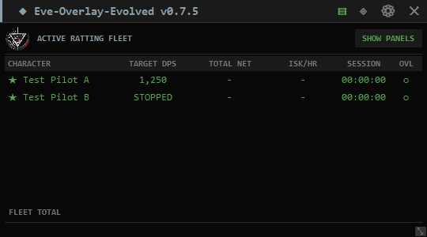
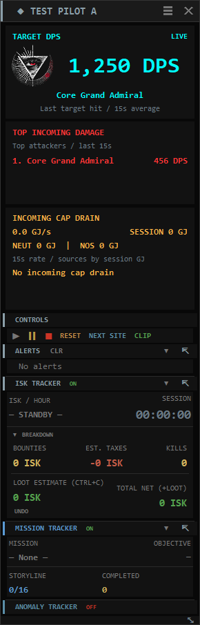
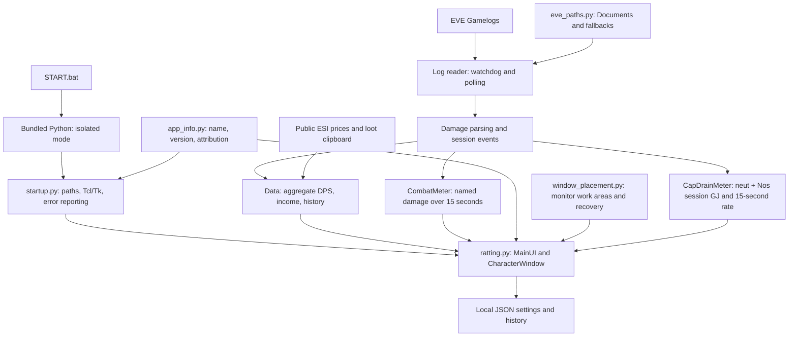
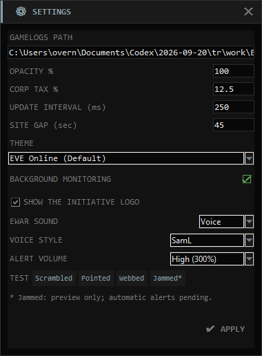

# Eve-Overlay-Evolved v0.7.5

A desktop combat and income overlay for EVE Online. Track target DPS,
who is dealing the most damage to you, incoming capacitor drain, bounties, loot and session progress
across multiple characters.

**Contributions:** [@bitsbetrippin](https://github.com/bitsbetrippin) — portable
launch workflow, combat-meter enhancements, feature direction, testing and
release development for Eve-Overlay-Evolved.

**Original concept and base implementation:**
[Eve-Ratting](https://github.com/psychojf/Eve-Ratting), by
[@psychojf](https://github.com/psychojf). This project builds on that work;
original authorship and bundled component notices are retained.
See [ATTRIBUTION.md](ATTRIBUTION.md).

**Repository:** [bitsbetrippin/eve-overview-evolved](https://github.com/bitsbetrippin/eve-overview-evolved).
The repository URL uses `overview`; the application name is **Eve-Overlay-Evolved**.
**Release tag:** `v0.7.5`.

## Download, extract, launch

1. Download **Eve-Overlay-Evolved-v0.7.5-Windows-x64.zip** from the release assets.
2. Right-click the ZIP and choose **Extract All** into a writable folder.
3. Open the extracted folder and double-click **START.bat**.
4. Select your characters, then press **Play** on a character dashboard.

The Windows 10/11 x64 package includes Python 3.13.15, Tcl/Tk and all app
packages. No Python installation, administrator access, pip command, PATH
editing or first-run setup download is needed. Keep the extracted files
and `runtime/` folder together. The console stays open while the app runs.
Quit all windows using the **X on the fleet overview**; a character
window's X hides that dashboard.

GitHub's **Code > Download ZIP** contains source without the runtime.
Use the versioned Windows release ZIP for the ready-to-run experience.
Market-price lookups use an internet connection while the app is running.

## What's new in v0.7.5

- **SamL** is a fifth option in **Settings > VOICE STYLE**, using four
  user-supplied MP3 recordings converted to bundled 16-bit mono WAVs.
- Scrambled, Pointed and Webbed use the existing incoming-only automatic
  triggers. **Jammed is a placeholder for a future release**, available only
  through the **Jammed*** TEST button while SamL is selected.
- The full supplied recordings are preserved (approximately 3.5–3.6 seconds).
  The original MP3s remain unchanged. SamL supports Low/Medium/High gain and
  saved preferences just like the other styles.
- Manual previews queue without live-alert expiry, so all four full clips can
  be tested in sequence. Live alerts still discard queued events older than
  8 seconds and limit repeats of each effect to once every 10 seconds.

Select **EWAR SOUND: Voice**, **VOICE STYLE: SamL**, choose volume, preview,
then click **APPLY**. Defaults remain Robot / Low (100%) until changed.
The four existing synthetic styles and Initiative logo option remain available.

All 16 WAVs are bundled; no decoder or internet is needed at runtime.
Jammed has no automatic trigger in this release. Existing automatic warnings
reflect incoming English log events, not a continuous measurement of tackle
status. Hidden dashboards require Background Monitoring and a running session.

## Interface layout

The **fleet overview** is the main hub: one row per character with total
target DPS, net ISK, ISK/hour, session time and the detached DPS-overlay toggle. Its
header provides Settings, Fleet Manager, clipboard lock and Quit. Hover
the application title for contributor and upstream credits. **SHOW PANELS**
beside ACTIVE RATTING FLEET brings dashboards back next to the overview.
Enable the optional INIT. logo and choose EWAR sound in Settings, then Apply.
Click a character row to show/hide that pilot's dashboard; the OVL column
controls the separate aggregate DPS overlay.



Each **character dashboard** is arranged from top to bottom:

| Section | Purpose |
| --- | --- |
| Character title bar | Pilot name; drag to move or double-click to collapse |
| **TARGET DPS — bold aqua** | DPS and name of the latest target hit |
| **TOP INCOMING DAMAGE — bold bright red** | Three attackers ranked by recent damage, with their DPS |
| **INCOMING CAP DRAIN — bold amber** | Combined GJ/sec and session GJ, NEUT/NOS split, top three sources by session total |
| Controls | Play, Pause, Stop, Reset, Next Site and clipboard lock |
| Alerts | Combat/EWAR notifications and session events |
| ISK tracker | ISK/hour, session timer, bounties, tax, kills, loot and net income |
| Missions or anomalies | Mission progress or site timing, counts and averages |



*Preview uses synthetic combat data. The meter panels stay aqua/red/amber
across themes. Other panels follow the selected theme.*

ISK, Missions, Anomalies and Alerts can detach into separate windows.
The independent DPS overlay remains available from the overview's OVL cell:
left-click to toggle; right-click for position and view options. It shows
total outgoing/incoming DPS, a graph, or both. Windows transparency and
click-through behavior are intended for borderless/fixed-window play.

## Combat meters and controls

The two damage panels use a **rolling 15-second window** and refresh at the configured
UI interval, **250 ms by default**. DPS is damage inside that window divided
by 15; it ramps up as hits arrive and falls to zero as they expire.

- **Target DPS** follows the latest name you hit in the combat log.
  Selecting a target alone cannot update the meter. If drones and weapons
  hit different targets, the latest hit determines the displayed target.
- **Incoming damage** aggregates damage by attacker name, sorts highest
  first, and shows three attackers. Hover for the full name and damage
  total. Rankings reflect recent totals, not largest volley or lifetime damage.
- Identically named NPCs share totals because parsed damage lines do not
  provide unique NPC IDs. Long names retain full hover details. Parsing
  supports plain/HTML-tagged English damage lines, corporation tags,
  ship suffixes, punctuation and HTML entities.

The original aggregate DPS counters and detached overlay remain separate
from the per-target display.

| Control | Current behavior |
| --- | --- |
| Play | Starts/resumes tracking; a new log session backfills recent bounties |
| Pause | Pauses the timer and log reading; recent damage ages out of the meters |
| Stop | Stops reading and freezes displayed values, including combat panels |
| Reset / Next Site | Saves the session when applicable, clears counters and meters, and leaves tracking stopped; press Play again |
| CLIP | Locks/unlocks clipboard reading across the fleet |
| UNDO | Removes the last imported loot value from that character's session |

**Site gap** (45 seconds by default) groups combat into anomalies without
resetting the session. **Next Site** performs a full reset. For an
MTU/salvage run, keep one session running to count all sites and the final
loot haul together.

## Incoming capacitor drain

The amber **INCOMING CAP DRAIN** panel sums incoming neutralizer and
Nosferatu loss as reported in the log. It shows the combined session GJ,
separate NEUT/NOS session subtotals and a combined 15-second GJ/sec rate.
It does not estimate capacitor remaining, regeneration, local module use,
or net capacitor balance. Capacitor gained is excluded.

The rate is recent loss divided by 15 and reaches zero without new events.
Session totals and rankings remain visible. Sources are grouped by their
full logged identity; hover reveals each source's NEUT/NOS split and last
module. Decorated `ship [alliance] [corp] [pilot]` entries show the pilot
name on the row. A changed logged identity creates a separate bucket.

The supported English raw-log format starts the amount with the incoming
`<color=0xffe57f7f>` marker. Neutralizers report positive `N GJ energy
neutralized`. Incoming Nos reports negative `-N GJ energy drained to`;
its magnitude is added as loss. `energy drained from`, positive Nos amounts,
directionless text and unknown color markers are skipped. Keep the markup.
Thousands separators and decimals are supported. Zero/-0 entries add no GJ
and do not increment positive-loss hit counts. Distinct same-second entries
each count once, even when their text matches.

Press Play before tracking. Existing entries are not backfilled. Pause stops
reading and the rate can expire; resume skips entries written while paused
and starts at the end of the log. Stop freezes the display. Reset / Next Site
clears the totals and leaves tracking stopped. Rates use monotonic arrival
time, so a batch of delayed entries contributes when read.

History JSON keeps `neut_received_gj`, `neut_hits` and `neut_sources_gj`
as neutralizer-only fields. New sessions also save `nos_received_gj`,
`nos_hits`, `nos_sources_gj` and combined `cap_drain_received_gj`,
`cap_drain_hits`, `cap_drain_sources_gj`. Old records are not rewritten;
missing Nos fields in old records mean not recorded. The History table's
existing columns remain unchanged.

## Architecture

The UI, parsing and existing session logic remain centered in `ratting.py`.
Small modules isolate release identity, startup, log-path discovery and
named combat metrics, incoming capacitor drain and monitor-aware placement.



| File / component | Responsibility |
| --- | --- |
| `START.bat` | Locates its folder and invokes bundled Python with `-I -B` |
| `startup.py` | Sets app/Tcl/Tk paths, starts `ratting.py`, provides `--self-test` and error logs |
| `app_info.py` | Product name, version, release tag, repository URL and credits |
| `ratting.py` | Tkinter windows, log tailing/rotation, session state, themes, alerts and price workers |
| `combat_meter.py` | Damage-line normalization, bounded named rolling totals, expiry and incoming ranking |
| `neut_meter.py` | Incoming neutralizer/Nos parsing, separate and combined totals, source ranking and GJ/sec |
| `ewar_alerts.py` | Incoming-only tackle/web parsing and serialized voice/beep playback, style selection and limited PCM gain |
| `assets/` | Initiative logo, robotic WAV warnings and source notices |
| `eve_paths.py` | Redirected Documents, OneDrive, standard Documents and Linux/Proton path candidates |
| `window_placement.py` | Monitor work areas, reachable title checks and dashboard recovery |
| `build_release.py` | Verifies/stages Python, installs pinned wheels, tests and builds the versioned ZIP |
| `requirements-windows.lock` | Exact Windows x64 wheels and SHA-256 hashes |
| `tests/test_release.py` | Startup, log paths, settings preservation and main-window checks |
| `tests/test_combat.py` | Parsing, attribution, rolling totals, log-to-widget updates and character panels |
| `tests/test_panels.py` | Multiple-pilot startup, row clicks, hidden/collapsed recovery and monitor geometry |
| `tests/test_neuts.py` | Anonymized neut/Nos replay, sign/direction checks, totals/rates, duplicate records, UI and history |
| `tests/test_ewar.py` | EWAR direction, sound queue, styles/gain, WAV integrity and live logo/settings checks |

The UI uses Tk's event loop. File notifications and timer polling drive
incremental log reading; market lookups run in background threads. Named
damage buckets use monotonic arrival time and a bounded event queue. Stop
snapshots remain frozen while live damage expires. JSON settings/history
use temporary-file replacement when written.

The app reads gamelogs produced by EVE. It does not read game-process
memory, modify the client or automate game inputs. Public ESI requests
supply market prices; clipboard access supports loot valuation unless
locked with CLIP.

## Paths, settings and upgrades

Windows discovery starts with the current user's actual Documents folder,
including OneDrive/redirection, then checks known fallbacks. A typical
location is `Documents/EVE/logs/Gamelogs`. Saved custom `log_path` settings
are preserved; change the path in Settings if needed. Characters appear
after EVE has written gamelogs.

All app state is stored beside `ratting.py`:

| File | Contents |
| --- | --- |
| `ratting_config.json` | Log path, pilot preferences, themes and window positions |
| `ratting_history.json` | Saved sessions |
| `ratting_prices.json` / `ratting_nameids.json` | Disposable price and item-ID caches |
| `startup.log` | Most recent caught Python startup/application failure |
| `ratting_debug.log` | Optional internal diagnostics |

The `ratting_*` filenames and `ratting.py` entry point remain for
compatibility with earlier Eve-Ratting-based releases.

To upgrade, close the old app, extract v0.7.5 into a new folder, and copy
`ratting_config.json` and `ratting_history.json` into it before launching.
The caches may also be copied. Do not overwrite the new runtime/source
with files from the old release.

## Source development and release builds

For source development, install Python 3.9+ with Tkinter, clone this
repository, then run:

```bat
python -m pip install -r requirements.txt
python ratting.py
```

Keep the helper modules beside `ratting.py`. Optional packages provide
clipboard support (`pyperclip`), tray/images (`pystray`, `Pillow`), and
file notifications (`watchdog`). All are included in the Windows release.
Source retains Linux/Proton path fallbacks; v0.7.5 packaging and GUI
verification target Windows x64.

Build on Windows:

```bat
python build_release.py
```

The builder verifies the official CPython 3.13.15 x64 runtime, installs
hash-pinned wheels, runs a runtime self-test and all four regression suites,
then writes:

```text
dist/Eve-Overlay-Evolved-v0.7.5-Windows-x64.zip
dist/Eve-Overlay-Evolved-v0.7.5-Windows-x64.zip.sha256
```

For an offline rebuild, supply a cached runtime archive and the exact wheels:

```bat
python build_release.py --cache PATH-TO-RUNTIME-CACHE --wheel-dir PATH-TO-WHEELS
```

For direct regression testing, copy `runtime/` from a portable release
beside the source, then run:

```bat
runtime\python.exe -I -B tests\test_release.py
runtime\python.exe -I -B tests\test_combat.py
runtime\python.exe -I -B tests\test_panels.py
runtime\python.exe -I -B tests\test_neuts.py
```

Runtime/build folders and user state are excluded from Git. Release source
belongs to the `v0.7.5` tag; the portable ZIP is the downloadable release
asset, distinct from GitHub's source-only ZIP.

## Troubleshooting and verification

- Missing runtime/script: extract the complete versioned Windows ZIP.
- No pilots: confirm the log path and that EVE has written gamelogs.
- Only the fleet overview appears: click **SHOW PANELS**. It brings active
  dashboards and existing detached sections beside the overview, expands
  collapsed dashboards and saves their new positions without resetting data.
- A pilot is absent from the fleet: enable it in Fleet Manager first.
- Meters show zero: press Play and allow new combat hits to arrive.
- Cap-drain total stays zero: check for incoming `GJ energy neutralized` or negative `GJ energy drained to` entries with original color tags, written while tracking.
- Startup failure: read the console and `startup.log`, if created.
- Runtime check: `START.bat --self-test` reports product/version, Python,
  Tk, package versions and log path without reading logs or the clipboard.
- Internal diagnostics: set `EVE_OVERLAY_EVOLVED_DEBUG=1` or add
  `"debug_log": true` to the config. Legacy `EVE_RATTING_DEBUG` also works.

Validation covers 88 automated checks and clean-extraction startup without
system Python on PATH, including conflicting Python/Tk settings. GUI
previews use synthetic data; tests also replay anonymized neutralizer/Nos records. Live EVE sessions and online
market-price services are not integration-tested.

See [HOW_TO.txt](HOW_TO.txt) and [CONTRIBUTING.md](CONTRIBUTING.md) for more.
Report bugs in [this project's issue tracker](https://github.com/bitsbetrippin/eve-overview-evolved/issues).
Bundled notices are in [THIRD-PARTY-NOTICES.txt](THIRD-PARTY-NOTICES.txt).

### Alliance branding and voice assets

`ewar_alerts.py` owns incoming EWAR parsing and one bounded audio queue shared
by the fleet. `ratting.py` supplies per-character visual alerts and persisted
`initiative_logo`, `ewar_audio`, `ewar_voice` and `ewar_volume` settings. Logo changes apply live to all windows.
`assets/` contains the official alliance PNG, 12 generated WAVs plus four user-supplied SamL WAVs and source notices.
`build_release.py` copies that directory; startup verifies that the assets exist.
`tests/test_ewar.py` covers direction, all alert types, queue behavior, WAV integrity,
and actual Tk settings/logo/log-reader integration. The suite brings the total to 88.

To regenerate the voice clips as a developer, use `generate_alert_audio.ps1
-EspeakExe C:/path/to/espeak-ng.exe` with eSpeak NG 1.52.0 and its data directory.
`robotic_audio.py` applies a mild radio texture to Robot; `generate_voice_styles.py`
generates the other three styles. eSpeak needs the en-us language and m1/m3/klatt
voice variants to regenerate these. Neither synthesizer nor generator
is required for normal use. Asset credits and sources are in `assets/NOTICE.txt`.



### SamL clips

`assets/voices/saml/` contains `scrambled.wav`, `pointed.wav`, `webbed.wav`
and `jammed.wav`. The last is a preview-only placeholder. `import-manifest.json`
records the original filenames, checksums, converted checksums and full durations.
`import_saml_audio.py --source <folder>` is a developer-only import helper requiring
miniaudio 1.71; it converts Sam-Scrambled.mp3, Sam-Pointed.mp3, Sam-Web.mp3 and
Sam-Jammed.mp3. The decoder is not shipped or required for playback.
For manual replacements, exit the app to clear its audio cache, then replace the
WAVs with the same filenames using uncompressed signed 16-bit PCM, preferably
mono 22,050 Hz. Clips do not get truncated when the volume booster is applied.
