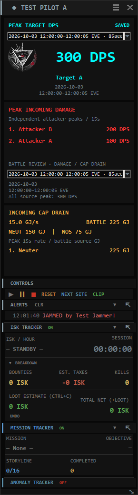
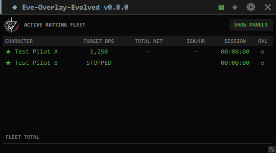
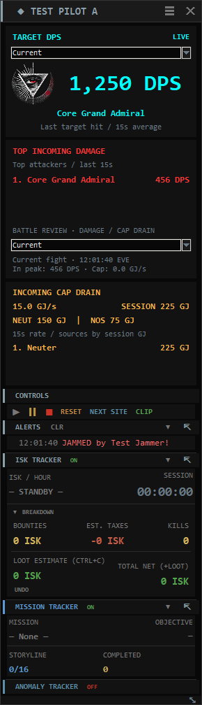
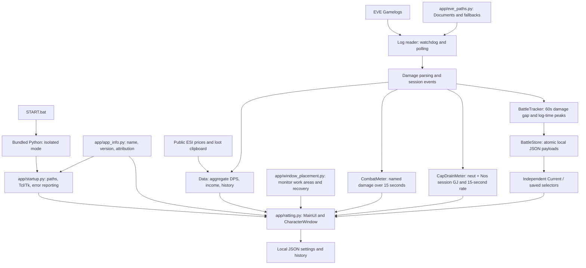
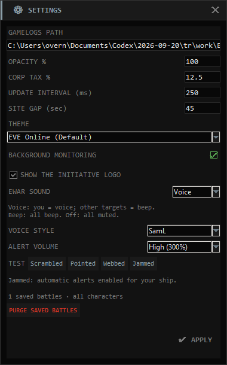

# Eve-Overlay-Evolved v0.8.1

A desktop combat and income overlay for EVE Online. Track target DPS,
who is dealing the most damage to you, incoming capacitor drain, bounties, loot and session progress
across multiple characters.

**Contributions:** [@bitsbetrippin](https://github.com/bitsbetrippin) — portable
launch workflow, combat-meter enhancements, feature direction, testing and
release development for Eve-Overlay-Evolved.

**Original concept and base implementation:**
[Eve-Ratting](https://github.com/psychojf/Eve-Ratting), by
[@psychojf](https://github.com/psychojf). This project builds on that work;
original authorship and bundled component notices are retained.
See [ATTRIBUTION.md](ATTRIBUTION.md).

**Repository:** [bitsbetrippin/eve-overview-evolved](https://github.com/bitsbetrippin/eve-overview-evolved).
The repository URL uses `overview`; the application name is **Eve-Overlay-Evolved**.
**Release tag:** `v0.8.1`.

## Download, extract, launch

1. Download **Eve-Overlay-Evolved-v0.8.1-Windows-x64.zip** from the release assets.
2. Right-click the ZIP and choose **Extract All** into a writable folder.
3. Open the extracted folder and double-click **START.bat**.
4. Select your characters, then press **Play** on a character dashboard.

The Windows 10/11 x64 package includes Python 3.13.15, Tcl/Tk and all app
packages. No Python installation, administrator access, pip command, PATH
editing or first-run setup download is needed. Keep the extracted files
and `runtime/` folder together. The console stays open while the app runs.
Quit all windows using the **X on the fleet overview**; a character
window's X hides that dashboard.

GitHub's **Code > Download ZIP** contains source without the runtime.
Use the versioned Windows release ZIP for the ready-to-run experience.
Market-price lookups use an internet connection while the app is running.

## What's new in v0.8.1 beta

This documentation update adds an illustrated README tutorial: find the Settings
gear, select SamL, set High (300%) alert gain and click Apply. The red boxes,
arrows and numbered steps use the real app layout. See the
[SamL setup walkthrough](../README.md#quick-setup-saml-voice-at-300).
Application behavior is unchanged from v0.8.0.

## Battle features introduced in v0.8.0

Battle Review adds local per-character battle history, independent outgoing
and incoming selectors, EVE-time ranges, 15-second peak metrics and a Settings
purge control. The portable root stays clean: START.bat and README.md, with
application, runtime, data and documentation in their own folders.

## Battle Review: current and previous engagements

Press Play to capture new fights. A positive damage event dealt or received
starts a battle. The next damage event keeps it open if the gap is less than
60 seconds. A gap of **60 seconds or more** ends the previous battle; after
60 seconds with no new damage read, it is saved even if no more log lines arrive.
The app drains pending log writes before making that idle decision.

The battle gap is fixed at 60 seconds, independent of the configurable anomaly
**Site gap**. Misses, EWAR, bounties and capacitor drain do not start or extend
the battle. Incoming neut/Nos loss after damage starts is included while the
fight remains open. Cap drain at or after its 60-second boundary is excluded
from that battle, but still counts in the regular session cap meter.

The two selectors are independent and default to **Current** on every launch:

| Selector | Current | Saved battle |
| --- | --- | --- |
| Above aqua DPS | Latest target hit and its live rolling DPS | Highest single-target 15-second peak and that target's name; hover for all-target peak and total damage |
| Battle Review, below red attackers | Recent attackers and session cap drain | Top three independent attacker peaks, combined incoming peak, and saved cap totals/rates below |

Choose any date/time entry in a dropdown to review it. The header repeats the
full **date and EVE/UTC time range**; dropdown entries also have a short ID to
distinguish similar fights. Midnight-spanning fights show both dates. The range
ends at the last included damage/cap event, not 60 seconds later at save time.
There is no outgoing peak in an incoming-only fight: it shows zero and
**No outgoing damage**.

Peak windows use the interval **(event time − 15 seconds, event time]**. Damage
or loss in that interval is divided by 15; short fights still use the full
denominator. Events sharing a log second each count. Ties keep the first peak.
Each attacker/target has its own peak timestamp, so the three displayed incoming
peaks need not be simultaneous. The combined incoming peak is calculated
separately and is not the sum of those individual maxima.

Saved peaks use log timestamps. Current live meters retain their monotonic
arrival-time behavior, so delayed logs can produce a different live rate.
Records older than the active battle's last accepted event are skipped for
battle accounting to protect chronological windows. Missing timestamps fall
back to the current UTC time. Identical logged names share a bucket.

The amber panel follows the **incoming** selector. Saved mode shows combined
peak GJ/s, battle GJ lost, separate NEUT/NOS totals, and three sources ranked
by total battle loss. Hover a source for its independent peak rate, split and
last module. Full payloads also retain separate neutralizer/Nos peak rates.
This measures logged loss, not capacitor remaining or net capacitor balance.

Reviewing history never pauses monitoring, switches the fleet DPS to old data,
or changes your income session. Choose **Current** on either dropdown to return
that section to normal. Pause, Stop, Reset/Next Site, Quit and suspension of
hidden monitoring save an open fight with **[partial]** and its close reason.
Reset clears live counters but retains archived battles. No automatic old-log
damage import or reconstruction of previous sessions is performed.



### Local storage and purge

Each saved battle is one UTF-8 JSON file in **data/battles/**. Its schema records
pilot ID/name, UTC range, complete/partial status, 15-second peaks/timestamps,
outgoing/incoming totals and source rows, plus neut/Nos breakdowns. Files are
written through temporary-file replacement; no battle data is uploaded.
Histories are separated by character ID and listed newest first.

**Settings > PURGE SAVED BATTLES** reports the archive count and asks for
confirmation. It deletes battle summaries for **all characters**, including
unreadable battle files and queued unsaved summaries. It keeps the active
fight, configuration, caches and income-session history. Both dropdowns return
to Current. This action cannot be undone; copy data/battles/ first for a backup.
There is no automatic retention limit.

An unreadable battle payload is skipped and counted in Settings rather than
blocking startup. A disk write failure retains the summary in memory, displays
an error in Battle Review and retries while the app is open. Completed/partial
records survive restart; an active fight or a still-unsaved retry can be lost
if the process terminates unexpectedly. Restore disk access before quitting.

## EWAR sound and jamming

**Jammed is now a live personal alert**, using the confirmed English combat-log
format `You're jammed by <attacker> - <ECM module>`. The real rich-text format
with its extra separator is supported. The dashboard shows **JAMMED by** and
the attacker's identity in the EWAR alert color, with the usual pulse.

- **Voice:** personal scram, point, web and jam events play the selected voice.
- **Beep:** personal events use the beep instead. **Off:** mutes all alerts.
- Other-target scram/point/web events keep using a beep when present in the log.
  The provided log confirms personal jams only; nearby/outgoing jam detection
  awaits a verified log format. Generic lock failures, warp interference and
  sensor recalibration messages never count as confirmed jams.

The existing full **SamL jammed.wav** is now used automatically. Robot,
Commanding, Dramatic and News anchor each gain their own Jammed clip, and the
**Jammed** TEST button is enabled for all five styles. All **20 WAVs** are
bundled for offline playback. Volume gain remains 100% / 200% / 300%.

Repeated jam records share the 10-second audio cooldown. Personal warnings
play before queued nearby beeps, with separate repeat limits. Personal queued
events now expire after **15 seconds** so four long SamL clips can play in turn;
nearby beeps still expire after 8 seconds. An already playing clip finishes
before the next begins. These are log-event warnings, not continuous effect
status or a measurement of jam duration.

Select **Settings > EWAR SOUND: Voice**, choose **VOICE STYLE** and
**ALERT VOLUME**, then **APPLY**. Existing saved choices are preserved.
Hidden dashboards require Background Monitoring and a running session.

## Interface layout

The **fleet overview** is the main hub: one row per character with live
target DPS, net ISK, ISK/hour, session time and the detached DPS-overlay toggle. Its
header provides Settings, Fleet Manager, clipboard lock and Quit. Hover
the application title for contributor and upstream credits. **SHOW PANELS**
beside ACTIVE RATTING FLEET brings dashboards back next to the overview.
Enable the optional INIT. logo and choose EWAR sound in Settings, then Apply.
Click a character row to show/hide that pilot's dashboard; the OVL column
controls the separate aggregate DPS overlay.



Each **character dashboard** is arranged from top to bottom:

| Section | Purpose |
| --- | --- |
| Character title bar | Pilot name; drag to move or double-click to collapse |
| **TARGET DPS — bold aqua** | Latest target DPS, or saved peak target DPS through its dropdown |
| **TOP INCOMING DAMAGE — bold bright red** | Three recent attackers, or independent saved peaks |
| **BATTLE REVIEW** | Incoming Current/saved selector, date/time range and combined incoming peak |
| **INCOMING CAP DRAIN — bold amber** | Combined GJ/sec and session GJ, or saved peak/battle totals, NEUT/NOS split and top sources |
| Controls | Play, Pause, Stop, Reset, Next Site and clipboard lock |
| Alerts | Combat/EWAR notifications and session events |
| ISK tracker | ISK/hour, session timer, bounties, tax, kills, loot and net income |
| Missions or anomalies | Mission progress or site timing, counts and averages |



*Preview uses synthetic combat data. The meter panels stay aqua/red/amber
across themes. Other panels follow the selected theme.*

ISK, Missions, Anomalies and Alerts can detach into separate windows.
The independent DPS overlay remains available from the overview's OVL cell:
left-click to toggle; right-click for position and view options. It shows
total outgoing/incoming DPS, a graph, or both. Windows transparency and
click-through behavior are intended for borderless/fixed-window play.

## Combat meters and controls

In **Current** mode, the two damage panels use a **rolling 15-second window** and refresh at the configured
UI interval, **250 ms by default**. DPS is damage inside that window divided
by 15; it ramps up as hits arrive and falls to zero as they expire.

- **Target DPS** follows the latest name you hit in the combat log.
  Selecting a target alone cannot update the meter. If drones and weapons
  hit different targets, the latest hit determines the displayed target.
- **Incoming damage** aggregates damage by attacker name, sorts highest
  first, and shows three attackers. Hover for the full name and damage
  total. Rankings reflect recent totals, not largest volley or lifetime damage.
- Identically named NPCs share totals because parsed damage lines do not
  provide unique NPC IDs. Long names retain full hover details. Parsing
  supports plain/HTML-tagged English damage lines, corporation tags,
  ship suffixes, punctuation and HTML entities.

The original aggregate DPS counters and detached overlay remain separate
from the per-target display.

| Control | Current behavior |
| --- | --- |
| Play | Starts/resumes tracking; a new log session backfills recent bounties |
| Pause | Pauses the timer and log reading; recent damage ages out of the meters |
| Stop | Stops reading and freezes displayed values, including combat panels |
| Reset / Next Site | Saves the session when applicable, clears counters and meters, and leaves tracking stopped; press Play again |
| CLIP | Locks/unlocks clipboard reading across the fleet |
| UNDO | Removes the last imported loot value from that character's session |

**Site gap** (45 seconds by default) groups combat into anomalies without
resetting the session. **Next Site** performs a full reset. For an
MTU/salvage run, keep one session running to count all sites and the final
loot haul together.

## Incoming capacitor drain

In **Current** mode, the amber **INCOMING CAP DRAIN** panel sums incoming neutralizer and
Nosferatu loss as reported in the log. It shows the combined session GJ,
separate NEUT/NOS session subtotals and a combined 15-second GJ/sec rate.
It does not estimate capacitor remaining, regeneration, local module use,
or net capacitor balance. Capacitor gained is excluded.

The rate is recent loss divided by 15 and reaches zero without new events.
Session totals and rankings remain visible. Sources are grouped by their
full logged identity; hover reveals each source's NEUT/NOS split and last
module. Decorated `ship [alliance] [corp] [pilot]` entries show the pilot
name on the row. A changed logged identity creates a separate bucket.

The supported English raw-log format starts the amount with the incoming
`<color=0xffe57f7f>` marker. Neutralizers report positive `N GJ energy
neutralized`. Incoming Nos reports negative `-N GJ energy drained to`;
its magnitude is added as loss. `energy drained from`, positive Nos amounts,
directionless text and unknown color markers are skipped. Keep the markup.
Thousands separators and decimals are supported. Zero/-0 entries add no GJ
and do not increment positive-loss hit counts. Distinct same-second entries
each count once, even when their text matches.

Press Play before tracking. Existing entries are not backfilled. Pause stops
reading and the rate can expire; resume skips entries written while paused
and starts at the end of the log. Stop freezes the display. Reset / Next Site
clears the totals and leaves tracking stopped. Rates use monotonic arrival
time, so a batch of delayed entries contributes when read.

History JSON keeps `neut_received_gj`, `neut_hits` and `neut_sources_gj`
as neutralizer-only fields. New sessions also save `nos_received_gj`,
`nos_hits`, `nos_sources_gj` and combined `cap_drain_received_gj`,
`cap_drain_hits`, `cap_drain_sources_gj`. Old records are not rewritten;
missing Nos fields in old records mean not recorded. The History table's
existing columns remain unchanged.

## Architecture

The UI, parsing and existing session logic remain centered in `app/ratting.py`.
Small modules isolate release identity, startup, log-path discovery and
named combat metrics, incoming capacitor drain and monitor-aware placement.



| File / component | Responsibility |
| --- | --- |
| `START.bat` | Locates its folder and invokes bundled Python with `-I -B` |
| `app/app_paths.py` | Central portable paths, data folders and non-overwriting legacy-state import |
| `app/startup.py` | Sets app/Tcl/Tk paths, starts `app/ratting.py`, provides `--self-test` and error logs |
| `app/app_info.py` | Product name, version, release tag, repository URL and credits |
| `app/ratting.py` | Tkinter windows, log tailing/rotation, session state, themes, alerts and price workers |
| `app/combat_meter.py` | Damage-line normalization, bounded named rolling totals, expiry and incoming ranking |
| `app/neut_meter.py` | Incoming neutralizer/Nos parsing, separate and combined totals, source ranking and GJ/sec |
| `app/battle_history.py` | Per-character fight lifecycle, event-time rolling peaks, validation, atomic persistence and purge |
| `app/ewar_alerts.py` | Recipient-aware tackle/web and confirmed personal ECM parsing; prioritized personal voice and nearby beep playback, style selection and limited PCM gain |
| `app/assets/` | Initiative logo, robotic WAV warnings and source notices |
| `app/eve_paths.py` | Redirected Documents, OneDrive, standard Documents and Linux/Proton path candidates |
| `app/window_placement.py` | Monitor work areas, reachable title checks and dashboard recovery |
| `tools/build_release.py` | Verifies/stages Python, installs pinned wheels, tests and builds the versioned ZIP |
| `app/requirements-windows.lock` | Exact Windows x64 wheels and SHA-256 hashes |
| `tests/test_release.py` | Startup, log paths, settings preservation and main-window checks |
| `tests/test_combat.py` | Parsing, attribution, rolling totals, log-to-widget updates and character panels |
| `tests/test_panels.py` | Multiple-pilot startup, row clicks, hidden/collapsed recovery and monitor geometry |
| `tests/test_neuts.py` | Anonymized neut/Nos replay, sign/direction checks, totals/rates, duplicate records, UI and history |
| `tests/test_battles.py` | Time boundaries, peak math, storage/retry, per-pilot isolation, purge and real Tk history selection |
| `tests/test_ewar.py` | EWAR direction, sound queue, styles/gain, WAV integrity and live logo/settings checks |

The UI uses Tk's event loop. File notifications and timer polling drive
incremental log reading; market lookups run in background threads. Named
damage buckets use monotonic arrival time and a bounded event queue. Stop
snapshots remain frozen while live damage expires. BattleTracker uses one bucket
per log second for recent peaks and retains cumulative source summaries.
BattleStore caches validated payloads; only archive changes refresh dropdown lists.
JSON settings/history
use temporary-file replacement when written.

The app reads gamelogs produced by EVE. It does not read game-process
memory, modify the client or automate game inputs. Public ESI requests
supply market prices; clipboard access supports loot valuation unless
locked with CLIP.

## Paths, settings and upgrades

Windows discovery starts with the current user's actual Documents folder,
including OneDrive/redirection, then checks known fallbacks. A typical
location is `Documents/EVE/logs/Gamelogs`. Saved custom `log_path` settings
are preserved; change the path in Settings if needed. Characters appear
after EVE has written gamelogs.

All writable app state is stored under `data/` in the release folder:

| File | Contents |
| --- | --- |
| `data/ratting_config.json` | Log path, pilot preferences, themes and window positions |
| `data/ratting_history.json` | Saved income sessions |
| `data/battles/<id>.json` | Per-character combat battle payloads and peak metrics |
| `data/cache/ratting_prices.json` / `data/cache/ratting_nameids.json` | Disposable price and item-ID caches |
| `data/logs/startup.log` | Most recent caught Python startup/application failure |
| `data/logs/ratting_debug.log` | Optional internal diagnostics |

The `ratting_*` filenames and `app/ratting.py` entry point remain for
compatibility with earlier Eve-Ratting-based releases.

To upgrade, close the old app and extract v0.8.1 into a new folder. From v0.7.7
and earlier, copy the old root `ratting_config.json` and `ratting_history.json`
into the new `data/` folder before launching. From v0.7.8 onward, copy `data/`.
Legacy root state is also imported when its new destination is absent;
existing new state and original legacy files are preserved.

## Source development and release builds

For source development, install Python 3.9+ with Tkinter, clone this
repository, then run:

```bat
python -m pip install -r app/requirements.txt
python app/ratting.py
```

Keep the helper modules beside `app/ratting.py`. Optional packages provide
clipboard support (`pyperclip`), tray/images (`pystray`, `Pillow`), and
file notifications (`watchdog`). All are included in the Windows release.
Source retains Linux/Proton path fallbacks; v0.8.1 packaging and GUI
verification target Windows x64.

Build on Windows:

```bat
python tools/build_release.py
```

The builder verifies the official CPython 3.13.15 x64 runtime, installs
hash-pinned wheels, runs a runtime self-test and all six regression suites,
then writes:

```text
dist/Eve-Overlay-Evolved-v0.8.1-Windows-x64.zip
dist/Eve-Overlay-Evolved-v0.8.1-Windows-x64.zip.sha256
```

For an offline rebuild, supply a cached runtime archive and the exact wheels:

```bat
python tools/build_release.py --cache PATH-TO-RUNTIME-CACHE --wheel-dir PATH-TO-WHEELS
```

For direct regression testing, copy `runtime/` from a portable release
beside the source, then run:

```bat
runtime\python.exe -I -B tests\test_release.py
runtime\python.exe -I -B tests\test_combat.py
runtime\python.exe -I -B tests\test_panels.py
runtime\python.exe -I -B tests\test_neuts.py
runtime\python.exe -I -B tests\test_ewar.py
runtime\python.exe -I -B tests\test_battles.py
```

Runtime/build folders and user state are excluded from Git. Release source
belongs to the `v0.8.1` tag; the portable ZIP is the downloadable release
asset, distinct from GitHub's source-only ZIP.

## Troubleshooting and verification

- Missing runtime/script: extract the complete versioned Windows ZIP.
- No pilots: confirm the log path and that EVE has written gamelogs.
- Only the fleet overview appears: click **SHOW PANELS**. It brings active
  dashboards and existing detached sections beside the overview, expands
  collapsed dashboards and saves their new positions without resetting data.
- A pilot is absent from the fleet: enable it in Fleet Manager first.
- Meters show zero: press Play and allow new combat hits to arrive.
- Cap-drain total stays zero: check for incoming `GJ energy neutralized` or negative `GJ energy drained to` entries with original color tags, written while tracking.
- Saved battle has not appeared: leave Play running until 60 seconds pass without damage. A cap-only exchange does not start a fight.
- A dashboard is too tall: collapse or detach the ISK, Missions or Alerts sections, or disable the optional logo.
- Startup failure: read the console and `data/logs/startup.log`, if created.
- Runtime check: `START.bat --self-test` reports product/version, Python,
  Tk, package versions and log path without reading logs or the clipboard.
- Internal diagnostics: set `EVE_OVERLAY_EVOLVED_DEBUG=1` or add
  `"debug_log": true` to the config. Legacy `EVE_RATTING_DEBUG` also works.

Validation covers 133 automated checks and clean-extraction startup without
system Python on PATH, including conflicting Python/Tk settings. GUI
previews use synthetic data; tests also replay anonymized neutralizer/Nos records. Live EVE sessions and online
market-price services are not integration-tested.

See [HOW_TO.txt](HOW_TO.txt) and [CONTRIBUTING.md](CONTRIBUTING.md) for more.
Report bugs in [this project's issue tracker](https://github.com/bitsbetrippin/eve-overview-evolved/issues).
Bundled notices are in [THIRD-PARTY-NOTICES.txt](THIRD-PARTY-NOTICES.txt).

### Alliance branding and voice assets

`app/ewar_alerts.py` parses EWAR recipients and owns one audio worker shared by
the fleet, with separate bounded queues and repeat limits for personal and
nearby events. Personal clips play first; nearby events always use a beep. `app/ratting.py` supplies per-character visual alerts and persisted
`initiative_logo`, `ewar_audio`, `ewar_voice` and `ewar_volume` settings. Logo changes apply live to all windows.
`app/assets/` contains the official alliance PNG, 16 generated WAVs plus four user-supplied SamL WAVs and source notices.
`tools/build_release.py` copies that directory; startup verifies that the assets exist.
`tests/test_ewar.py` replays anonymized real ECM records and covers direction,
all alert types, duplicate cooldown, queue behavior, WAV integrity,
and actual Tk settings/logo/log-reader integration. The full release has 133 regression checks across six suites.

To regenerate the voice clips as a developer, use `tools/generate_alert_audio.ps1
-EspeakExe C:/path/to/espeak-ng.exe` with eSpeak NG 1.52.0 and its data directory.
`tools/robotic_audio.py` applies a mild radio texture to Robot; `tools/generate_voice_styles.py`
generates the other three styles. eSpeak needs the en-us language and m1/m3/klatt
voice variants to regenerate these. Neither synthesizer nor generator
is required for normal use. Asset credits and sources are in `app/assets/NOTICE.txt`.



### SamL clips

`app/assets/voices/saml/` contains `scrambled.wav`, `pointed.wav`, `webbed.wav`
and `jammed.wav`. All four support automatic personal alerts. `import-manifest.json`
records the original filenames, checksums, converted checksums and full durations.
`tools/import_saml_audio.py --source <folder>` is a developer-only import helper requiring
miniaudio 1.71; it converts Sam-Scrambled.mp3, Sam-Pointed.mp3, Sam-Web.mp3 and
Sam-Jammed.mp3. The decoder is not shipped or required for playback.
For manual replacements, exit the app to clear its audio cache, then replace the
WAVs with the same filenames using uncompressed signed 16-bit PCM, preferably
mono 22,050 Hz. Clips do not get truncated when the volume booster is applied.
